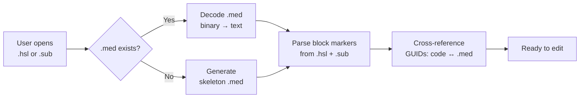
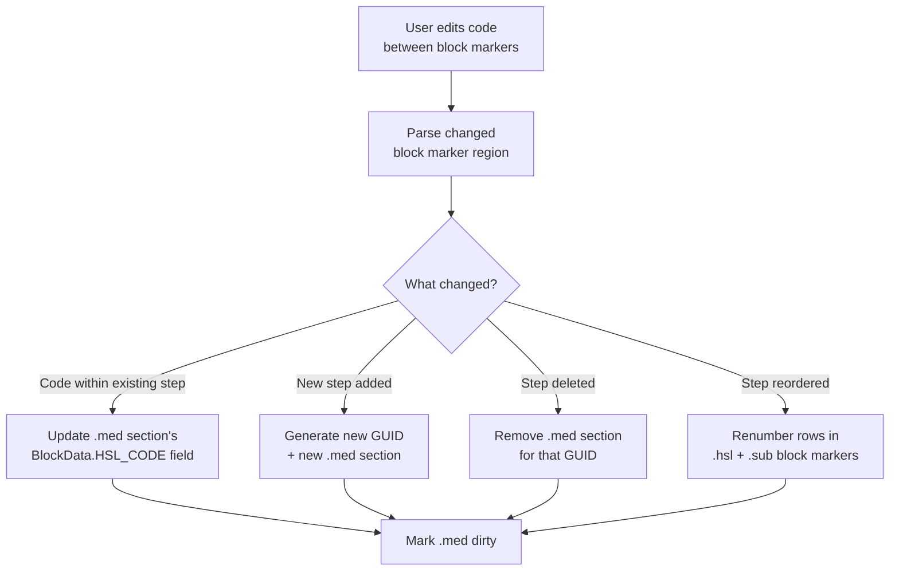
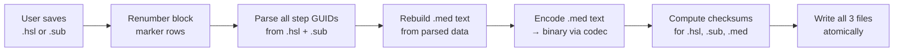
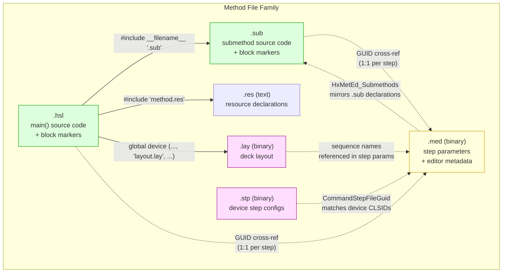

# MED ↔ HSL / SUB Sync Pipeline

> How the three files link together and the exact orchestration needed for
> VS Code editing of Hamilton method files.

---

## 1. The Three-File Family

Every Hamilton *method* on disk is (at minimum) four files sharing a base name:

| File | Format | Role |
|------|--------|------|
| `<Name>.hsl` | HSL source (text) | **main()** function + structural boilerplate |
| `<Name>.sub` | HSL source (text) | Submethod definitions (OnAbort, user functions) |
| `<Name>.med` | HxCfgFile v3 (binary) | Step parameter store — **one section per step GUID** + editor metadata |
| `<Name>.stp` | HxCfgFile v3 (binary) | Device step parameters — full config for hardware commands (present only when device steps exist) |

The `.hsl` and `.sub` are linked at compile time by an `#include`:

```hsl
// {{{ 2 "LocalSubmethodInclude" ""
 namespace _Method {  #include __filename__ ".sub"  }
// }} ""
```

`__filename__` resolves to the base name of the `.hsl` at compile time, so
`Global_Answer_Key_CH07.hsl` includes `Global_Answer_Key_CH07.sub`.

---

## 2. The GUID Cross-Reference — The Master Key

The **instance GUID** is the primary key that links a code block in
`.hsl`/`.sub` to its parameter section in `.med`.

### 2.1 In the `.hsl` / `.sub`

Each step is wrapped in a *block marker* pair. The opening marker carries
the step's **instance GUID** and **step CLSID**:

```hsl
// {{ 5 1 0 "9ed2d1b4_fe42_470a_8be8b5694f47165b" "ML_STAR:{541143FA-7FA2-11D3-AD85-0004ACB1DCB2}"
{
    variable arrRetValues[];
    arrRetValues = ML_STAR._541143FA_7FA2_11D3_AD85_0004ACB1DCB2("9ed2d1b4_fe42_470a_8be8b5694f47165b"); // TipPickUp
}
// }} ""
```

Format: `// {{ ROW COL SUBLEVEL "instance_guid" "step_clsid"`

- **instance_guid** — unique per step *instance*; format `xxxxxxxx_xxxx_xxxx_xxxxxxxxxxxxxxxx`
- **step_clsid** — identifies the *type* of step (Comment, Loop, device command, etc.)
  May be bare `{CLSID}` for general steps or `DEVICE:{CLSID}` for device steps.

### 2.2 In the `.med` (decoded)

The same GUID appears as a **DataDef section name**:

```
DataDef,HxPars,3,9ed2d1b4_fe42_470a_8be8b5694f47165b,
[
"33",
"3",
"(1",
"10",
"",
...
")"
];
```

### 2.3 GUID Cardinality Rules

| Rule | Detail |
|------|--------|
| **1 GUID → 1 .med section** | Every unique instance GUID gets exactly one `DataDef,HxPars,3,<guid>` section |
| **1 GUID may appear multiple times in .hsl** | Multi-block steps (Loop, If/Then/Else) use the *same* GUID for opening+closing markers. The .med stores them as `(BlockData (1 ...) (2 ...) )` |
| **Steps in .sub also get .med sections** | Submethod steps have their own unique GUIDs; their parameter sections live in the **same** `.med` file as the main method steps |
| **No GUID overlap between .hsl and .sub** | A GUID belongs to *either* main() or a submethod — never both |
| **Orphaned .med sections are possible** | If a step was deleted from `.hsl`/`.sub` but the .med was not re-synced, the .med may retain a stale section (harmless but wasteful) |

### 2.4 Verified Cross-Reference Results

**Global_Answer_Key_CH07** (simple method):

```
.hsl step GUIDs:  9 unique  (10 marker pairs; loop GUID appears twice)
.sub step GUIDs:  0
.med step GUIDs:  9         ← Perfect 1:1 match
```

**Hamilton Liquid Waste Demo** (method with submethods):

```
.hsl step GUIDs:  12 unique (17 marker pairs; multi-block steps)
.sub step GUIDs:   4 unique
.med step GUIDs:  17         ← 16 matched + 1 orphan (deleted step retained in .med)
Combined code:    16         ← 12 + 4 = 16 matched perfectly
```

---

## 3. What the .med Stores Per Step

Each `DataDef,HxPars,3,<guid>` section contains a token array. The tokens
are structured as key/value pairs in Hamilton's HxPars encoding:

### 3.1 Step-Type-Specific Parameters

These vary by step CLSID:

| Step Type | Key Fields in .med |
|-----------|--------------------|
| **Comment** | `1Comment` (text), `3TraceSwitch` (0/1) |
| **Loop** | `3ComparisonOperator`, `1LeftComparisonValue`, `1LoopCounter`, `3LoopMode`, `(SelectedSequences` |
| **If/Then/Else** | `1ConditionOne`, `1ConditionTwo`, `3CompareOperator`, `3Else` |
| **Assignment** | `3Expression`, `1Result` |
| **Device step** | `33` (type), `3` (version) — minimal; device config is in `.stp` |
| **Library function call** | `1FunctionName`, `1ReturnValue`, `3FieldCount`, `(FunctionPars`, `1-534642685` (source .hsl path) |
| **Custom dialog** | `1DialogHandle`, `1DialogTitle`, `1Xaml` (full WPF XAML), `(Pictures` (embedded JPG base64) |

### 3.2 Universal Sections in Every Step

```
"3ParsCommandVersion"    → always present; value "1" or "2"
"(BlockData"             → code + display metadata per block
  "(1"                   → block 1 (e.g., loop opening)
    "1-533921779"        → HSL_CODE   ← THE ACTUAL CODE SNIPPET
    "1-533921780"        → DISPLAY_TEXT (what Venus shows in method view)
    "1-533921781"        → STEP_TYPE_NAME (e.g., "Loop", "Comment")
    "1-533921782"        → ICON filename (e.g., "Loop.bmp")
  ")"
  "(2"                   → block 2 (e.g., loop closing) — only multi-block steps
    ...
  ")"
")"
"1Timestamp"             → last-modified timestamp
"(Variables"             → variable tracking for undo/dependency resolution
```

### 3.3 The HSL_CODE Field (field -533921779)

**This is the critical sync field.**

The `1-533921779` value in each BlockData block is the HSL source code that
the Method Editor wrote between the block markers. When syncing `.hsl` → `.med`:

```
.hsl block marker code → .med BlockData.1-533921779
```

The code stored in the .med is **identical** to the code between the
block markers in the .hsl, with these normalizations:
- Newlines appear as literal `\n` in the token string
- Leading/trailing whitespace may be trimmed
- For device steps, the code is the boilerplate `arrRetValues = ML_STAR._CLSID("guid")`

---

## 4. Multi-Block Steps (Loop, If/Then, Switch)

Some steps produce 2+ block marker pairs in the .hsl but only ONE .med section.

**Example: Loop step** `0f6781fa_661c_4f6d_82c54ea3235441dd`

In `.hsl`, the GUID appears at **row 4** (loop open) and **row 9** (loop close):

```hsl
// {{ 4 1 0 "0f6781fa_..." "{B31F3532-...}"     ← block 1 (open)
{
loopCounter1 = 0;
while ( (ML_STAR.Samples96.GetCurrentPosition() > 0) )
{
AlignSequences(hslTrue, ML_STAR.Samples96, 1);
loopCounter1 = loopCounter1 + 1;
// }} ""

... (inner steps: rows 5-8) ...

// {{ 9 1 0 "0f6781fa_..." "{B31F3532-...}"     ← block 2 (close)
if ( ... ) { MECC::EndlessSequenceLoopWarning(GetFileName()); }
}
ML_STAR.Samples96.SetMax(ML_STAR.Samples96.GetTotal());
ML_STAR.Samples96.SetCurrentPosition(1);
}
// }} ""
```

In `.med`, this becomes ONE section with TWO BlockData entries:

```
DataDef,HxPars,3,0f6781fa_661c_4f6d_82c54ea3235441dd,
[
...
"(BlockData",
"(1",                    ← block 1 code
"1-533921779",
"{\nloopCounter1 = 0;\nwhile (...) ...",
")",
"(2",                    ← block 2 code
"1-533921779",
"if (...) { MECC::EndlessSequenceLoopWarning(...); }\n...",
")",
")"
];
```

---

## 5. The .med Editor Metadata Sections

Beyond per-step sections, the .med has 4 metadata sections:

### 5.1 `HxMetEdData` — Editor Version & Component Flags

```
"1Version"              → e.g., "6.0.2.3426"
"3-533725180"           → 1  (unknown flag)
"3-533725181"           → 1045  (feature bitmask?)
"(-533725182"
"3SchedCompCmd"         → 1
"3CustomDialogCompCmd"  → 1
"3MultiPipCompCmd"      → 1
"3GRUCompCmd"           → 1
")"
```

**Sync rule:** Set version to match the Hamilton installation; keep component
flags in sync with the `// {{ 2 "TemplateIncludeBlock"` section in `.hsl`.

### 5.2 `HxMetEd_MainDefinition` — main() Declaration

```
"3-533725173"    → 3 (method type: 3 = method, others = library etc.)
"(-533725157"
  "(-533725169"  → parameter list (empty for main)
  ")"
  "1-533725170"  → "" (return type annotation)
  "3-533725171"  → 0 (scope flags)
  "1-533725161"  → "main"  ← the function name
  "3-533725172"  → 1 (public)
")"
```

**Sync rule:** Always `"main"`. No parameters. Matches `method main() void {`
in `.hsl`.

### 5.3 `HxMetEd_Submethods` — Submethod Registry

Lists every submethod from `.sub` along with its parameters+types:

```
"(-533725162"
"(0"                     ← submethod index 0
  "(-533725169"          ← parameter list
  "(0"
    "1-533725168" → "i_blnFunctionSuccess"    ← param name
    "3-533725165" → "1"                       ← type (1 = variable)
    "3-533725166" → "1"                       ← direction (1 = in)
  ")"
  "(1"
    "1-533725168" → "i_strFunctionName"
    ...
  ")"
  ")"
  "1-533725161" → "_HandleFunctionSuccess"    ← submethod name
  "3-533725172" → "0"                        ← 0 = private
")"
"(1"                     ← submethod index 1
  ...
  "1-533725161" → "OnAbort"
  "3-533725172" → "1"                        ← 1 = public
")"
")"
```

**Sync rule:** Parse `.sub` to extract:
- Function names from `function <Name>(...) void {` declarations
- Parameter names, types, and directions from signatures
- Access level from `private` keyword presence

### 5.4 `HxMetEd_Outlining` — Code Folding State

Tracks which GUIDs are folded/expanded in the Venus UI:

```
"30f6781fa_661c_4f6d_82c54ea3235441dd0"  → "2"
```

**Sync rule:** Optional. VS Code can generate a default (all expanded = `"2"`)
or omit entirely.

---

## 6. The `.hsl` / `.sub` Include & Declare Linkages

### 6.1 Header Declarations in `.hsl`

```hsl
global device ML_STAR ("layout.lay", "ML_STAR", hslTrue);  // → links .lay
#include "method.res"                                        // → links .res
```

These establish links to `.lay` and `.res` files, which are NOT
stored in the `.med` — they are **independent companions**.

### 6.2 `.sub` Inclusion Mechanism

```hsl
// {{{ 2 "LocalSubmethodInclude" ""
 namespace _Method {  #include __filename__ ".sub"  }
// }} ""
```

`__filename__` = the `.hsl` base name at compile time. This means:
- `.hsl` and `.sub` MUST share the same base name
- The `.sub` is always compiled in `_Method` namespace scope

### 6.3 Row Numbering Continuity (Critical!)

**Block marker row numbers are sequential across `.hsl` AND `.sub`.**

In the Liquid Waste Demo:
- `.hsl` uses rows 1–17  (main method steps)
- `.sub` uses rows 19–23 (submethod steps)

Row 18 is skipped (structural markers). The row counter is **global**
across both files because Venus treats them as one merged source.

**Implication for VS Code:** When renumbering block markers, the `.sub`
rows must start after the last `.hsl` row.

---

## 7. The Complete Sync Pipeline

### 7.1 Opening (.hsl/.sub → .med decode)



**Steps:**
1. Open `.hsl` or `.sub` in VS Code
2. If companion `.med` exists, decode it using the pure Python codec
   (`hxcfgfile_codec.py to-text`) — no external tools needed
3. Parse block markers from both `.hsl` and `.sub` to get all step GUIDs
4. Cross-reference against .med sections — verify GUID alignment

### 7.2 Editing (.hsl/.sub ↔ .med sync)



**Edit propagation rules:**

| Change in `.hsl`/`.sub` | Required .med update |
|--------------------------|---------------------|
| Code inside existing block markers edited | Update `1-533921779` (HSL_CODE) in the GUID's .med section |
| New block marker pair inserted | Create new `DataDef,HxPars,3,<new_guid>` section |
| Block marker pair deleted | Remove the corresponding .med section (or leave as orphan) |
| Block markers renumbered | No .med change needed (rows are .hsl-only) |
| Variable added/renamed | Update `(Variables` section in affected step's .med section |
| Submethod added in `.sub` | Add entry in `HxMetEd_Submethods`; generate step sections for the submethod's GUIDs |
| Submethod removed from `.sub` | Remove entry from `HxMetEd_Submethods`; remove orphaned step sections |
| Submethod parameter changed | Update parameter entries in `HxMetEd_Submethods` |

### 7.3 Saving (.hsl/.sub → .med re-encode)



**Steps:**
1. **Renumber block markers** — sequential rows across `.hsl` then `.sub`
2. **Parse all step GUIDs** — from both files; group multi-block steps
3. **Rebuild .med text** — one `DataDef,HxPars,3,<guid>` per unique GUID;
   for each, extract the code from between block markers and write it
   into `BlockData.1-533921779`
4. **Regenerate meta sections** — `HxMetEdData`, `HxMetEd_MainDefinition`,
   `HxMetEd_Submethods`, `HxMetEd_Outlining`
5. **Encode to binary** — using the pure Python codec
   (`hxcfgfile_codec.py to-binary`)
6. **Compute checksums** — CRC-32 footer for `.hsl`, `.sub`, `.med`
7. **Write all files** — ensure consistency

---

## 8. Field-Level Sync Map

This is the definitive map of which data moves where during sync.

### 8.1 `.hsl` / `.sub` → `.med` (on save)

```
Source (.hsl/.sub)                          Target (.med section)
─────────────────────────────────────────── ──────────────────────────────────────────
Block marker instance GUID                  Section name: DataDef,HxPars,3,<GUID>
Block marker CLSID                          Determines step-specific fields to write
Code between block markers (per block)      BlockData.(N).1-533921779  = HSL_CODE
Block count for multi-block steps           Number of (N) sub-entries in BlockData
Step type deduced from CLSID                BlockData.(N).1-533921781 = STEP_TYPE_NAME
Icon lookup from CLSID                      BlockData.(N).1-533921782 = ICON
Comment text from MECC::TraceComment()      1Comment field
Loop condition from while()                 3ComparisonOperator, 1LeftComparisonValue
If condition from if()                      1ConditionOne, 1ConditionTwo
Assignment target                           1Result
Variables referenced in code                (Variables section
Library function source path                1-534642685
Submethod declarations in .sub              HxMetEd_Submethods entries
Current timestamp                           1Timestamp
.hsl TemplateIncludeBlock libraries         HxMetEdData component flags
```

### 8.2 `.med` → `.hsl` / `.sub` (on open / import)

```
Source (.med section)                       Target (.hsl/.sub)
─────────────────────────────────────────── ──────────────────────────────────────────
Section GUID                                Block marker instance GUID
Step CLSID (inferred from fields)           Block marker step CLSID
BlockData.(N).1-533921779 (HSL_CODE)        Code between block markers
Number of BlockData blocks                  Number of block marker pairs for this GUID
HxMetEd_MainDefinition.main                 method main() void { ... }
HxMetEd_Submethods entries                  function declarations in .sub
HxMetEd_Submethods parameter list           function parameter signatures
HxMetEdData component flags                 TemplateIncludeBlock #includes
```

---

## 9. Checksum Footer

All three files share the same footer format:

```
// $$author=Hafele_C$$valid=0$$time=2023-10-18 10:37$$checksum=3e1c4153$$length=087$$
```

For `.med`, the comment prefix is `*` instead of `//`:

```
* $$author=Hafele_C$$valid=0$$time=2023-10-18 10:37$$checksum=dd764177$$length=086$$
```

| Field | Description |
|-------|-------------|
| `author` | Windows username of last writer |
| `valid` | 0 = unsigned, 1 = signed by Hamilton's COM |
| `time` | Timestamp `YYYY-MM-DD HH:MM` |
| `checksum` | CRC-32 of file content (excluding the footer line itself) |
| `length` | Total length of the footer line in bytes |

**Sync requirement:** After writing any file, recompute the checksum and
regenerate the footer. The `valid` flag should be set to `0` unless
Hamilton's `HxSecurityCom` COM object is available to re-sign it.

---

## 10. Full Dependency Diagram



---

## 11. Worked Example: End-to-End Save

Given `Global_Answer_Key_CH07.hsl` is edited (user modifies the comment text):

1. **User saves** `Global_Answer_Key_CH07.hsl`

2. **Extension handler** `correctBlockMarkersOnSave()` fires:
   - Reads `.hsl` content
   - Confirms step block markers exist → proceeds
   - Confirms `Global_Answer_Key_CH07.med` exists → proceeds
   - Renumbers block marker rows: 1, 2, 3, ... 10

3. **`syncMedFromHsl()`** runs:
   - Parses `.hsl` block markers → extracts 9 unique GUIDs
   - **Should also** parse `.sub` block markers → 0 GUIDs in this case
   - Reads `.sub` forward declarations → `OnAbort` submethod
   - For each GUID, extracts the code between its block markers
   - Builds `.med` text sections:
     - `DataDef,ActivityData,1,ActivityData` (preserved from existing .med)
     - `DataDef,HxPars,3,0f6781fa_...` — Loop step with 2 BlockData blocks
     - `DataDef,HxPars,3,122ed496_...` — TipEject (device step: minimal)
     - `DataDef,HxPars,3,25c835eb_...` — Aspirate (device step: minimal)
     - `DataDef,HxPars,3,54a5860a_...` — Initialize (device step: minimal)
     - `DataDef,HxPars,3,8b09ddec_...` — Comment step with updated text
     - `DataDef,HxPars,3,9ed2d1b4_...` — TipPickUp (device step: minimal)
     - `DataDef,HxPars,3,a80126d9_...` — Dispense (device step: minimal)
     - `DataDef,HxPars,3,bd9dbe52_...` — UnloadCarrier (device step: minimal)
     - `DataDef,HxPars,3,edd0cc33_...` — LoadCarrier (device step: minimal)
     - `DataDef,HxPars,3,HxMetEdData` — version + component flags
     - `DataDef,HxPars,3,HxMetEd_MainDefinition` — main()
     - `DataDef,HxPars,3,HxMetEd_Outlining` — folding state
     - `DataDef,HxPars,3,HxMetEd_Submethods` — OnAbort
   - Encodes text → binary using codec
   - Writes `.med` file

4. **Checksum update**:
   - `.hsl` footer recomputed
   - `.med` footer recomputed (with `*` prefix)
   - `.sub` remains unchanged (was not edited)

5. **Files on disk are now in sync** — Venus can open the `.med` and
   the block markers in `.hsl`/`.sub` will align.

---

## 12. HxCfgFile v3 Binary Container Format

The `.med`, `.stp`, and `.lay` files all use `HxCfgFile v3` binary format.
The pure-Python codec (`hxcfgfile_codec.py`) handles binary↔text conversion
without COM or external executables.

### 12.1 Binary Container Layout

| Offset | Type | Content |
|--------|------|---------|
| 0 | `u16le` | File version = `3` |
| 2 | `u16le` | Section type = `1` (ActivityData header) |
| 4 | `u32le` | Section-name count = `1` |
| 8 | short-string | `ActivityData,ActivityData` |
| — | `u16le` | Field type = `1` |
| — | `u32le` | Field count = `1` |
| — | short-string | Key: `ActivityDocument` |
| — | var-string | Value: base64 blob |
| — | `u8` | HxPars section count |
| — | 3 bytes | Padding (`00 00 00`) |
| — | repeated | HxPars sections (count times) |
| — | `\r\n` | Line break before footer |
| — | text | Footer: `* $$author=...$$checksum=...$$length=...$$` |

Each HxPars section:

| Type | Content |
|------|---------|
| short-string | Section name: `HxPars,<key>` |
| `u16le` | Pars version = `3` |
| `u32le` | Token count |
| repeated var-string | Tokens |

### 12.2 Primitive String Encodings

- **short-string** — `u8 length` + bytes (latin1)
- **var-string** — if length ≤ 254: `u8 length` + bytes; if length ≥ 255: `0xFF` + `u16le length` + bytes

### 12.3 Conversion Commands

```powershell
# Pure Python codec (handles both .med and .stp — no external dependencies)
python hxcfgfile_codec.py to-text  "input.med" "output_text.med"
python hxcfgfile_codec.py to-binary "input_text.med" "output.med"

python hxcfgfile_codec.py to-text  "input.stp" "output_text.stp"
python hxcfgfile_codec.py to-binary "input_text.stp" "output.stp"
```

The codec auto-detects the named section type (`ActivityData` for `.med`,
`Method,Properties` for `.stp`, or absent) and round-trips both formats
with byte-perfect accuracy.

---

## 13. Companion File Internals (.stp, .lay, .res)

### 13.1 `.stp` — Device Step Command Metadata

The `.stp` file stores the **full parameter configuration** for every device
step in the method. While the `.med` file stores only minimal stubs for
device steps (just 3 field IDs), the `.stp` contains the complete parameter
trees including pipetting settings, error recovery policies, channel
patterns, and liquid class references.

**Binary format:** HxCfgFile v3 (same container as `.med`).

**Key difference from `.med`:**
- `.med` has `ActivityData,ActivityData` named section (flowchart blob)
- `.stp` has `Method,Properties` named section (or no named section at all)
- `.stp` has **no** `ActivityData` — no flowchart, just step parameters

**Section model:**

- `DataDef,Method,1,Properties, { ReadOnly, "0" }` — read-only flag
- `DataDef,HxPars,3,<instance_guid>, [ ... ]` — one per device step
- `DataDef,HxPars,3,AuditTrailData, [ ")" ]` — audit trail
- Footer checksum line

**Core fields per device step:**

| Field | Type | Description |
|-------|------|-------------|
| `1CommandStepFileGuid` | String | Instance GUID — links to block marker in `.hsl` |
| `3NbrOfErrors` | Int | Number of error recovery entries |
| `1StepName` | String | Display name (e.g., "Initialize", "TipPickUp") |
| `1SequenceObject` | String | Sequence variable reference |
| `1SequenceName` | String | Sequence name from `.lay` |
| `1ChannelPattern` | String | Channel enable mask (e.g., `11111111`) |
| `3TipType` | Int | Tip type identifier |
| `3UseDefaultWaste` | Int | Use default waste sequence |
| `3LiquidFollowing` | Int | Enable liquid level following |
| `3TouchOffMode` | Int | Touch-off mode for dispense |
| `1LiquidName` | String | Liquid class name |
| `1BarcodeTraceFile` | String | Barcode trace output file |
| `1BarcodesToRead` | String | Which barcodes to read (e.g., `"1,2"`) |
| `3AlwaysInitialize` | Int | Force re-initialization flag |
| `(Errors` | Nested | Error recovery policy tree |
| `3ParsCommandVersion` | Int | Parameter schema version |
| `1Timestamp` | String | Last modification timestamp |

**Error recovery tree structure:**

```
"(Errors",           ← Start of error list
"(1",                ← Error entry #1
"3RepeatCount", "0",
"3UseDefault",  "1",
"3Timeout",     "0",
"1ErrorSound",  "",
"3AddRecovery", "0",
"3Infinite",    "1",
")",                 ← End of error entry #1
"(2",                ← Error entry #2 ...
...
")"                  ← End of error list
```

For liquid-handling commands (Aspirate, Dispense), additional typed fields
encode per-channel settings: `3LiquidFollowing`, `3TouchOffMode`,
`1LiquidName`, `3cLLD`, `3Submergence`, `3FixedHeight`, etc.

### 13.2 `.lay` — Deck Topology, Sequences, Device Config

`.lay` is `HxCfgFile v3` and is the densest configuration file.

**Section model:**

- `DataDef,DECKLAY,5,ML_STAR, { ... }` — labware, transforms, sequences
- `DataDef,DEVICE,2,ML_STAR, { ... }` — device origin/registration
- `DataDef,RESOURCES,1,default, { ... }` — resource bindings
- `DataDef,SYSTEM,1,default, { ... }` — system flags

**Key DECKLAY fields:**

| Field Family | Example | Purpose |
|-------------|---------|---------|
| `Labware.N.File` | `Cos_96_Fl.rck` | Labware definition file |
| `Labware.N.Id` | `Samples` | Labware identifier |
| `Labware.N.TForm.1.(X\|Y\|Z)` | Placement transforms |
| `Seq.<id>.Name` | `Samples96` | Sequence name |
| `Seq.<id>.Item.<k>.ObjId` | Link to labware | |

### 13.3 `.res` — Resource Declarations

`.res` is plain text with a checksum footer.

```hsl
#pragma once
global resource Res_ML_STARlet(1, 0xff0000, Translate("ML_STARlet"));
```

Contains resource identity mappings (`map`/`rmap` functions) used by the
scheduler/runtime resource tracking system.
